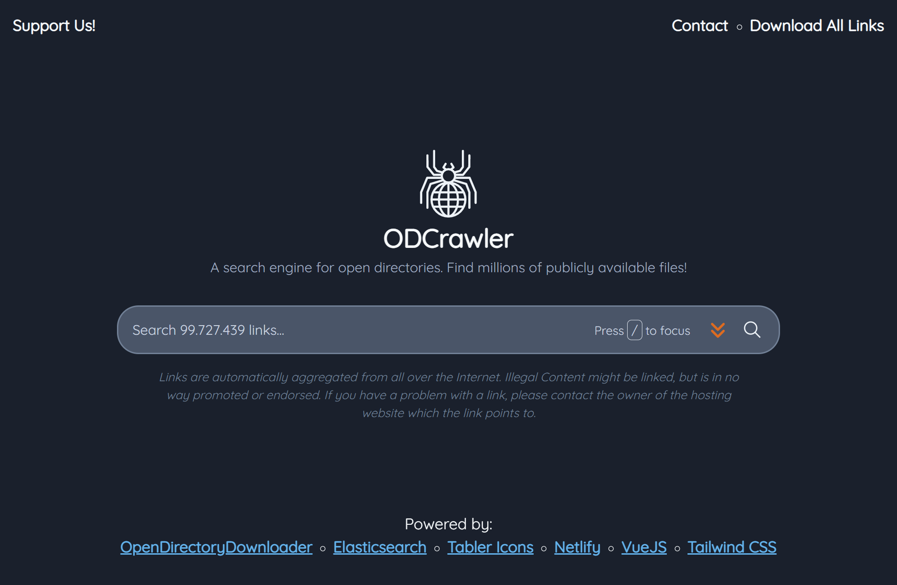

# ODCrawler

<!--  -->

## Search through millions of publicly accessible links to files!

---

### *What is this?*

ODCrawler is a search engine for *open directories* - publicly accessible web servers that list and serve various files.  
In these open directories (often referred to as "OD") you can find and download all kinds of files, from useful ressources to entertainment media or programs.

---

### *How does it work?*

We collected a vast amount of ODs and indexed every link we found inside them, so that you can search all of these links for keywords. Because the urls (links) to the files contain the actual file name at the end, this works really well.

---

### *Is it free?*

There are two parts to this question:  

1. This tool (ODCrawler) is completely free. We don't record your searches, we don't use or sell your data, we don't show ads. (Though if you enjoy it, we would appreciate [a small donation](https://github.com/sponsors/MCOfficer))  
2. Open Directories are more complex. They are free to access and therefore technically are free, but there are might be content in there that is protected by copyright. Always keep in mind, *just because it is accessible, that doesn't mean you are allowed to download it*! When in doubt, try contacting the website/content owner and confirm with them.

---

### *Is there a way I can contribute?*

Glad you asked! You could help us out in numerous ways:

- We have two GitHub repositories, one for the frontend/website (this one right here) and another one for the backend [here](https://github.com/MCOfficer/odcrawler-discovery). You could contribute code (new features, fixes, etc.) in the form of a pull request, or open issues where you request useful features or point out a bug to us.
- If code and issues aren't quite your thing, how about searching for new ODs? If you find a new OD that we haven't indexed yet (just try searching for the url on ODCrawler), just send them to us and we will do our best to include them! Just check our contact options below.
- If you just want to use the tool the way it is, that's fine as well. However, it would be awesome of you if you'd consider [supporting this project](https://github.com/sponsors/MCOfficer), because the servers we need for the search and database to work aren't free...

---

### Contacting Us

You can find us on various platforms:

- ODCrawler: https://odcrawler.xyz/contact
- @MCOfficer:
  - [GitHub](https://github.com/MCOfficer)
  - [Reddit](https://www.reddit.com/user/MCOfficer)
- @Chaphasilor:
  - [GitHub](https://github.com/Chaphasilor)
  - [Reddit](https://www.reddit.com/user/Chaphasilor)
  - [Twitter](https://twitter.com/Chaphasilor)